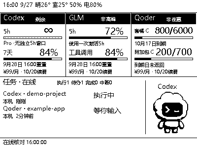
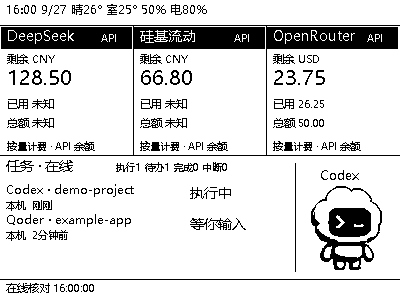

# RLCD AI Lab Dashboard

**把本机 AI 额度和任务进度，放到桌面上的一块小屏幕。**

面向 Waveshare ESP32-S3-RLCD-4.2 的 400 × 300 黑白看板，提供 **订阅额度版** 和 **API 余额版**。默认监控运行服务的这台 Windows 电脑，也可添加局域网或外网设备。



> 图片中的金额、额度、日期、环境读数和任务均为演示数据，不对应真实账户或设备。截图展示当前部署的 Codex 宠物外观；仓库不附带官方宠物素材文件。

## 一屏看清

| 区域 | 内容 |
| --- | --- |
| Codex | 5h 与长周期剩余额度、重置日期；适用时显示 ∞ |
| GLM | Coding Plan 额度、进度条、高峰/非高峰提示 |
| Qoder | 套餐与附加包的 **剩余 / 总额**、套餐到期日、夜惠提示 |
| 订阅 | 金额、币种，以及按月/年自动滚动的预计续费日期 |
| 本机任务 | 执行、等待确认/输入、本轮完成、中断及离线状态 |
| 可选设备 | 接入局域网或外网电脑，与本机一起显示 |
| 环境 | 时间、可选天气、板载温湿度和电量 |

固定单屏、静音，无弹窗遮挡。屏幕约 3 秒取图，网页任务每 30 秒核对，额度每 5 分钟采集；超过 15 分钟未更新会显示过期状态。

## 工作方式

```text
本机 Codex / Qoder 任务 + 账户额度 → 看板服务 → ESP32-S3 屏幕
                                      ↑
可选：其他 Windows → 局域网 / 私有网络 / HTTPS
```

本机采集随看板服务启动，无需额外下载代理或配置网络地址。本机额度仅采集一次，任务标记为“本机”。可选远程采集程序只上报状态元数据，支持持久化、去重与断网重传；15 秒心跳，60 秒无心跳标记离线。完整任务列表在网页查看。

## Windows 快速开始

需要 Python 3.11+。在仓库根目录运行：

```powershell
py -3 -m venv work/rlcd_companion/server/.venv
work/rlcd_companion/server/.venv/Scripts/python.exe -m pip install -r work/rlcd_companion/server/requirements.txt
Copy-Item work/rlcd_companion/server/config.example.yaml work/rlcd_companion/server/config.yaml
```

使用 Qoder 时额外安装：

```powershell
work/rlcd_companion/server/.venv/Scripts/python.exe -m pip install -r work/rlcd_companion/server/requirements-qoder.txt
```

双击 **start-dashboard.cmd**，打开 <http://127.0.0.1:8787/>。

服务会自动准备本机任务采集与 Hooks。首次启动后，在 Codex 客户端审核并信任 Hooks，重启 Qoder；不绕过客户端信任设置。无需安装远程采集包。

- **Codex**：先在本机官方客户端登录，采集程序只读账户额度。
- **GLM**：在配置页输入个人 Coding Plan Key。
- **Qoder**：选择令牌所属的 qoder.cn 或 qoder.com，再填入 Personal Access Token，两站令牌不能混用。
- **订阅**：填写金额和一次续费基准日期，默认按月/年自动滚动下一期；也可关闭自动滚动，手动维护。
- **天气**：公开配置不包含实际坐标。需要时仅在本机 `config.yaml` 填写。

停止和诊断分别使用 **stop-dashboard.cmd**、**diagnose-dashboard.cmd**。开发板烧录与连接见 [Windows 部署说明](docs/windows-monitor.md)。

## 订阅版与 API 版

网页“屏幕版本”可手动切换两种布局。订阅版默认 Codex、GLM、Qoder，也可从五个平台中选择三个；API 版独立显示三个 API 账户的余额和币种，接口返回时同时显示已用与总额。两种版本都保留任务状态和宠物，不自动轮播。



在“更多订阅与 API 账户”展开连接设置，填写后点击“保存并测试”，核对结果后启用自动查询。新增账户默认关闭；密钥留空保留已有值，不回显。平台暂未返回的数值显示未知，多币种分别显示，不跨币种相加。

| 连接 | 凭据与查询方式 |
| --- | --- |
| Claude 订阅 | 读取本机 Claude Code OAuth 登录；也可填写 OAuth Access Token。查询 5 小时及 7 天窗口，过期后需重新登录 |
| Grok 订阅（实验性） | 读取本机 Grok CLI 登录或填写 OAuth Access Token；参考 CC Switch 的 Grok Build 账单查询，不保证普通网页订阅兼容 |
| DeepSeek API | API Key，官方余额接口 |
| 硅基流动 API | API Key，选择中国站或国际站 |
| OpenRouter API | 管理密钥，需具有 `/credits` 查询权限；余额为累计购买减累计使用 |
| New API 中转站 | 账户访问令牌、用户 ID、完整 `/api/user/self` 地址；不是模型调用 Key。换算除数按站点规则填写 |
| 自定义 API | GET + Bearer + JSON 字段路径，例如 `data.balance`；可配置已用、总额、币种及除数 |

连接设计参考 [CC Switch](https://github.com/farion1231/cc-switch)。本项目不执行自定义 JavaScript、不导入 CC Switch 数据库、不发送模型请求。Claude/Grok 接口不是通用 API Key 余额接口，也不自动刷新登录。Grok 使用非公开稳定协议，无法识别响应时显示错误并保留旧快照，不能保证长期兼容。新增订阅采集器已做模拟响应测试，真实账户仍需用户登录后验证。

余额模板依据 [DeepSeek 官方文档](https://api-docs.deepseek.com/api/get-user-balance/)、[硅基流动接口定义](https://github.com/siliconflow/siliconcloud/blob/main/openapi.yaml) 和 [OpenRouter Credits 接口](https://openrouter.ai/docs/api/api-reference/credits/get-credits)。自定义地址只允许 HTTPS（本机或私网可用 HTTP），不跟随重定向，避免凭据转发到其他地址。

## 可选：Codex 应用中的 ChatGPT 会话

Windows 支持实验性的本机只读状态桥接，每 30 秒读取 Codex 应用自身的 ChatGPT 会话列表，显示在同一个任务区。订阅版和 API 版都支持；不需要 ChatGPT API Key。

在 **Codex 应用提供的终端环境**中，从项目根目录执行以下命令，然后重启看板服务：

```powershell
work/rlcd_companion/server/.venv/Scripts/python.exe work/rlcd_companion/server/monitor_chatgpt.py --pair
```

普通终端如果没有应用提供的管道及会话上下文，绑定会失败。绑定信息只保存在本机 `server/data/chatgpt-bridge.json`，不可公开。删除该文件并重启服务可停用。

- 只调用应用的 `list_threads`，丢弃会话摘要，只保留标题、会话 ID、状态和时间；不调用读取正文、附件、发送消息或批准操作的工具。
- 范围是应用列出的所有置顶会话及最近 50 项非置顶会话中的 ChatGPT 会话；不是全账户历史扫描，也不监控独立浏览器或独立 ChatGPT 客户端。
- 按应用明确提供的状态显示。**空闲不等于本轮完成**；不会把用户消息的 `completed` 当作助手回复已完成，也不推测百分比。首次接入仅展示近期空闲会话与可识别的活动状态。
- 断连立即标记状态源未知；列表中消失的任务不视为完成。并行会话互不覆盖，等待后恢复沿用本轮，空闲后再次运行创建新轮次。
- 使用的是本机已安装应用工具的内部管道协议，不是承诺稳定的公开接口。Codex 需要保持运行；应用升级、绑定会话不可用或多个应用管道无法区分时，网页显示错误，需要重新绑定。

## 电脑 USB 断连后息屏

在网页“屏幕息屏设置”中选择自动息屏开关和等待时间，默认 **5 分钟**，设为 **0** 可在断连确认后立即息屏；关闭开关可保持常亮。需要刷入支持此功能的固件，网页会显示固件上报状态。

- 通过电脑 USB 的 SOF 信号判断连接，不依赖是否打开串口；电脑休眠也可能触发，不能用来判断独立充电器是否通电。
- 断连持续 3 秒才开始计时；启动时保留至少 10 秒缓冲，防止枚举过程误触发。
- 息屏时关闭显示、Wi-Fi 和功放，CPU 降至 80 MHz，保留 USB 检测。它不是物理断电，也不是 MCU 深度睡眠，不承诺特定待机电流。
- 重新连接电脑 USB 或按板上 KEY/BOOT 键恢复显示。按键唤醒后，本次断连期间不再自动息屏，直到下一次连接并断开 USB。
- 配置随取图下发并保存在设备中，离线重启后仍有效；已息屏时请先唤醒，再修改设置。拔线后继续计时需要安装电池。

检测方式与休眠限制参考 [Espressif USB Serial/JTAG 文档](https://docs.espressif.com/projects/esp-idf/en/v5.2/esp32s3/api-guides/usb-serial-jtag-console.html)；屏幕采用 ST7305 Display OFF / Sleep IN 指令。

## 可选：添加局域网或外网设备

展开网页中的“添加远程设备（可选）”，填写目标设备能访问的看板地址，下载配对包，复制到目标 Windows 并运行 `install.cmd`。

- 同一局域网：填写看板电脑的局域网地址。
- 不同网络：可用 ZeroTier 等私有网络，也支持已部署的 HTTPS 反向代理地址。
- 安装包配置的是**看板服务地址**，不是被监控电脑的地址；远程电脑主动上报。

按客户端要求审核 Codex Hooks，重启 Qoder，再运行 `diagnose.cmd` 检查。监控程序不会批准操作、回答问题或控制 AI 任务。“本轮完成”只表示当前回复结束，不代表整个项目完成。

配对包包含专用上报令牌，应私下传输，不可公开。看板电脑需要保持开机和服务运行。

## 数据含义

- Codex 子 agent 根据会话元数据中的父子关系归入主会话，不按项目名猜测合并。子 agent 不独占屏幕；活动子任务在网页折叠详情里查看，结束的子任务进入历史。
- 主任务完成、中断或失败后在屏幕停留 5 分钟，再退出屏幕，网页仍可查看。独立对话即使项目名相同也分别保留。
- 已部署的远程采集器需要更新 `agent.py` 并重启，才会补报父子关系；无需删除队列、数据库或重新配置密钥。本机采集器随服务自动更新。旧采集器尚未补报时，服务不能可靠区分历史子会话。

- 缺失额度显示未知，不当作零；未返回重置时间的 5h 窗口显示使用提示。
- Codex 以接口实际窗口为准。当前实现对 Pro 缺少独立 5h 窗口时显示 ∞，不表示所有 Pro 账户永久无限额。
- Qoder 套餐到期日与额度重置时间分开处理，不推测附加包到期日。
- 续费基准日期按账单填写一次。短月取月底，之后恢复原始日号（如 1 月 31 日 → 2 月 28 日 → 3 月 31 日）；年付同样保留闰年规则。当天仍显示当天，次日滚动到下一期。这里只计算预计日期，不确认实际扣款，也不将套餐到期日当作续费日。
- 费用和息屏设置保存后直接生效，不额外触发额度查询；更换账户后不会写入旧账户尚未完成的查询结果。设置文件写入失败时保留原有内存配置。
- GLM 高峰与 Qoder 夜惠按 UTC+8 和活动规则显示；夜惠仅适用于官方指定模型。规则可能变化，见 `monitor_periods.py`。
- 同一账户在不同电脑使用相同账户标识，保留最新快照，不累加余额。

## 隐私与配置

公开仓库仅包含源代码、模板和演示图。真实凭据、Wi-Fi 配置、账户快照、任务数据库、日志、配对包及固件备份均应保留在本机，并已加入忽略规则。

远程上报使用 Bearer 鉴权，配置接口只允许本机访问。外网建议通过私有网络连接；使用 HTTPS 反向代理时仅转发 `/api/ingest/`，不要开放设置、配对、预览与其他接口。不要直接映射明文 HTTP 端口到公网。文档中的 `192.0.2.x` 为文档专用示例地址，不是部署地址。

## 开发与测试

```text
work/rlcd_companion/server/              服务、采集器、渲染与测试
work/rlcd_companion/agent/               本机与可选远程采集、Hooks
work/rlcd_companion/firmware/rlcd_client/ Arduino 固件
work/rlcd_companion/scripts/             启动、诊断与部署工具
work/vendor/                            硬件库及其许可文件
```

```powershell
cd work/rlcd_companion/server
.venv/Scripts/python.exe -m pytest -q
```

`/preview.png` 为屏幕预览，`/frame.bin` 固定 15,000 字节。GitHub Actions 自动运行测试；真实账户、客户端 Hooks 和硬件仍需部署后核验。

## 来源与许可

本项目独立维护，额度与任务界面面向本看板设计。

- [原始硬件项目](https://github.com/ljzqp/waveshare-esp32-s3-rlcd-4.2-ai-dashboard)：复用的固件、基础服务与备用像素宠物来源。
- [InfoHub](https://github.com/iwascy/InfoHub)：采集器架构参考，未复制其代码。
- 微雪开发包及第三方库保留各自许可；Codex 名称和截图中的宠物外观属于相应权利人。

新增独立模块采用 MIT 许可，范围见 [LICENSE-ADDITIONS.md](LICENSE-ADDITIONS.md)。复用代码不被此许可重新授权；来源记录见 [原始项目说明](docs/UPSTREAM-README.md)。

### 屏幕与电脑不在同一网络

可选用[私有 HTTPS 画面中继](work/rlcd_companion/relay/README.md)：由采集电脑渲染并上传，屏幕直接取图，无需屏幕所在网络的电脑常驻。包含独立读写令牌、证书验证、过期画面拒绝、温湿度回传及进程守护。默认本机监控方式保持不变。
